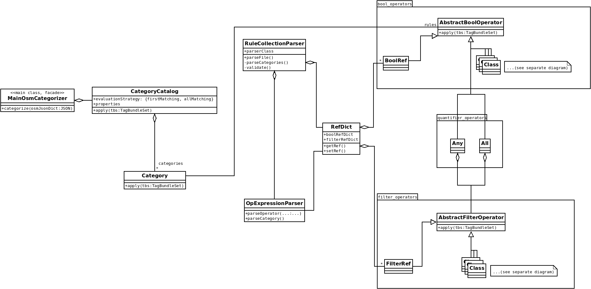
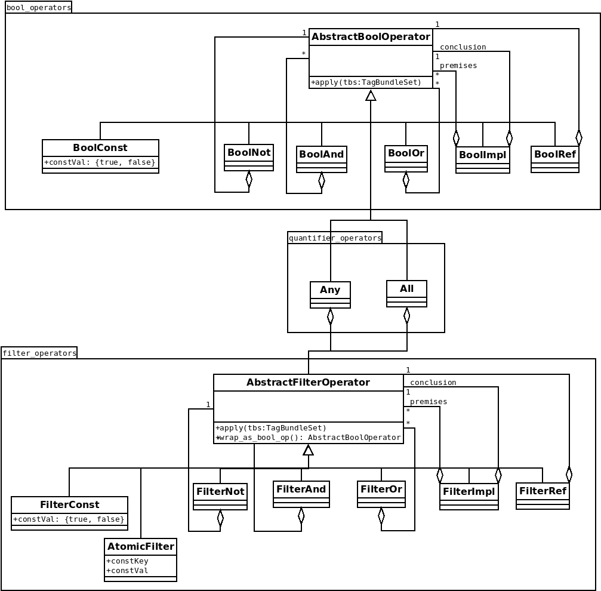
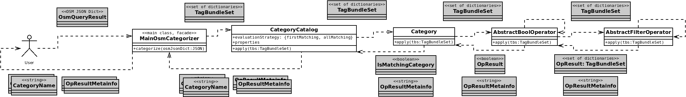

# OpenLostCat Developers' Documentation

## General structure

## Operators

Type of logic... - unimodal?, ~tuple calculus

Filter and Bool level ...

Quantifier wrapping ...

### Adding new operators or filters

...

for quantifiers: hash table for exact / at least/most counts

...

## Processing flow

## Parsing

<!---->

## Testing

...

