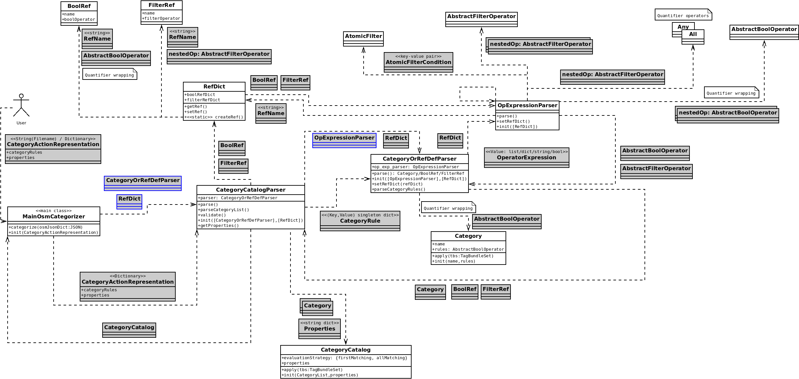

# OpenLostCat Developers' Documentation

## General structure

## Operators

Filter and Bool level ...

Quantifier wrapping ...

## Adding new operators or filters

...

## Processing flow

## Parsing

<!---->

## Testing

...

